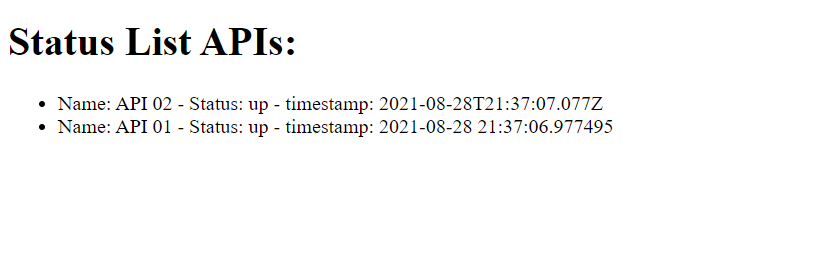

# Grupo de Estudos Devops
## _Capítulo de hoje: Docker e DockerCompose_
O objetivo dessa semana é subir uma rede onde deve existir um frontend e duas APIs.
O frontend deve ser capaz de se comunicar com as apis, para poder fazer requisições via GET.
O frontend é feito em html com javascript, uma api é feita em python e outra feita em nodeJS.
Quando o frontend se comunica com os outros serviços a tela abaixo deve ser obtida:

## Instruções
- O frontend deve rodar na porta 5000/tcp.
- A API01 deve rodar na porta 8080/tcp.
- A APPI02 deve rodar na porta 8081/tcp.
- Erros foram colocados propositalmente para que o ambiente não funcione.
- Como um dos objetivos do devops é a cola entre Dev e Infra, alguns erros no código das aplicações foram introduzidos para nos forçar a também entender de código, porém relaxem que foram coisas bem simples.
- Um desafio secreto foi introduzido, apenas com curiosidade esse poderá ser solucionado.

## Desejável
- O seu progresso deve ser anotado para posteriormente discutirmos onde teve dificuldade.
- As anotações são importante pois as vezes vários caminhos levam para a mesma solução.

## Ajuda
procure pelos termos abaixo para auxiliar na solução do desafio:
- Docker, Dockerfile e docker-compose.
- Github, docker hub.
- API Rest# grupo-de-estudos-devops
